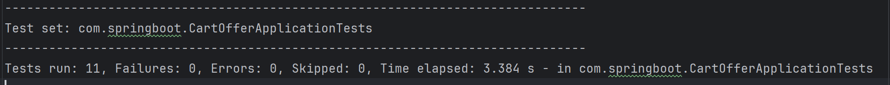

# SDET Assignment Submission

## 👋 Hello!

This is my submission for the **SDET Assignment**. Below you'll find a summary of my deliverables, testing coverage, discovered issues, and implementation notes.

---

## Included in the Submission

| File/Folder                          | Description |
|-------------------------------------|-------------|
| `CartOfferApplicationTests.java`    | Full suite of automated test cases using JUnit |
| `test-cases.xlsx`                   | Excel sheet containing detailed test cases with Expected, Actual, and Result columns |
| `initializer.json`                  | MockServer mapping for user segments: p1, p2, p3 |
| `README.md`                         | This document summarizing the assignment approach and outcome |

---

## ✅ Assignment Expectations & My Implementation

| Requirement                                               | Status                                                                                |
|-----------------------------------------------------------|---------------------------------------------------------------------------------------|
| 1. Setup and run existing test case                       | ✅ Done – Existing tests are fixed and running                                         |
| 2. Prepare a list of good test cases for full coverage    | ✅ Done – Comprehensive positive, negative, and edge cases created                     |
| 3. Implement a few test cases in the project & report     | ✅ Done – 11+ Critical JUnit tests added with assert checks, remarks, and bug tracking |

---

## Functional Test Coverage

| Area                                     | Covered |
|------------------------------------------|---------|
| FLATX and FLATX% discount logic          | ✅ Yes  |
| Segment-based offer filtering            | ✅ Yes  |
| Best discount between flat and percent   | ✅ Yes  |
| High cart value scenarios                | ✅ Yes  |
| Cart value = 0                           | ✅ Yes (🐞 Bug noted) |
| Unknown user segment                     | ✅ Yes  |
| Segment mismatch scenarios               | ✅ Yes  |
| Server failure handling (Mock 500)       | ✅ Yes  |

---

## 🐞 Bugs / Observations Discovered

| TC ID | Summary |
|-------|---------|
| TC006 | ❌ Discount applied on cart value `0` → returns negative total (should remain 0) |
| TC005 | ❌ FLATX inserted first but FLATX% gets applied instead (violates priority assumption) |
| TC009 | ⚠️ Discount calculation shows floating-point truncation (3999.0 instead of expected 3999.6) |

> All bugs are annotated in the Excel test case sheet under the **"Remarks"** column.

---

## Sample Test Scenarios Implemented (Detailed in [Click to open test-cases](test-cases/Cart_Offer_TestCases.csv))

- ✅ TC001: FLAT 20Rs discount for segment `p1`
- ✅ TC002: 10% discount for segment `p1`
- ✅ TC005: Best discount applied (FLATX vs FLATX%)
- ✅ TC007: Unknown user (MockServer doesn't return segment)
- ✅ TC009: High cart value with 60% off (floating-point issue flagged)
- ✅ TC011: Offer exists for a different segment — not applied

---

## Results (Surefire Reports):

___

Thank you for the opportunity!

**– Gourav Jain**